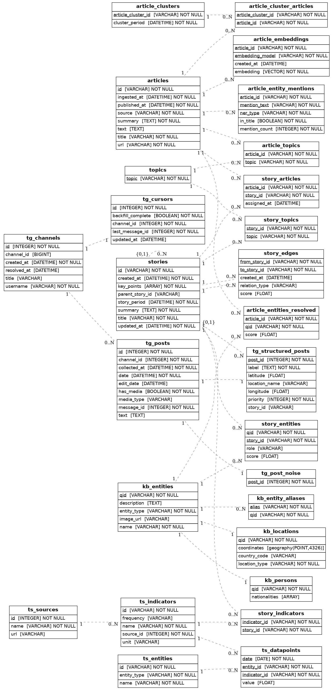

# Context Data Schemas

This repo contains shared data contracts and database migrations.

## Schema



## Setup

1. Copy environment file and update values:
   ```bash
   cp .env.example .env
   ```
2. Install dependencies:
   ```bash
   poetry install
   ```

## Migrations

Ensure `DATABASE_URL` is set (local `.env` or environment).

### Generate a migration

After modifying models in `rds_postgres/models.py`, generate a migration:

```bash
poetry run alembic revision --autogenerate -m "description of changes"
```

Review the generated file in `rds_postgres/alembic/versions/` to ensure the changes are correct.

### Apply migrations

```bash
poetry run alembic upgrade head
```

## Local tunnel (example)

If your database is only reachable via a tunnel, establish it first, then run migrations.
